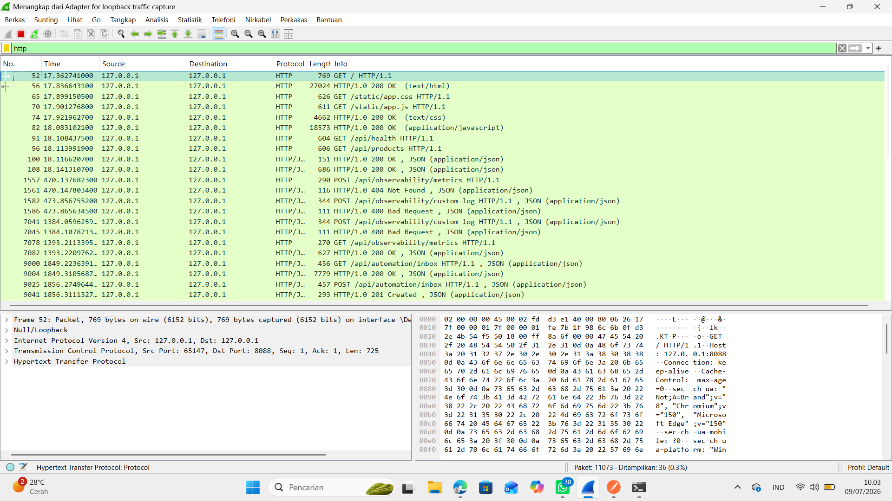

# 📊 Analisis Network Observability pada Protokol Jaringan Terdistribusi

## 👤 Identitas Mahasiswa
* **Nama:** Putri Sahira Wulandari
* **Program Studi:** Data Science
* **Universitas:** Universitas Cakrawala
* **Materi:** Pertemuan 12 - Monitoring, Logging, Telemetry, & Observability

## 📦 Deskripsi Project
Project ini eksperimen menguji *Network Observability* menggunakan **Postman** dan **Wireshark**.

> **Analogi:** Kayak cek resi paket online. Status "Terkirim" di aplikasi harus dibuktikan dengan cek di gudang/log. Di sini kita cek sampai level paket jaringan.

## 🛠️ Lingkungan Pengujian
* **Demo App:** `http://127.0.0.1:8088`
* **Client:** Postman
* **Sniffer:** Wireshark

## 📈 Hasil Pengujian
1. **200 OK:** Request berhasil, Wireshark tangkap JSON
2. **404 Not Found:** Rute `/metrics-salah` ditolak
3. **400 Bad Request:** Payload `"scenario": null` ditolak
4. **n8n:** 2 hit tercatat di `/api/automation/inbox`

## 📷 Dokumentasi Bukti Eksperimen

### 1. HTTP 200 OK

### 2. HTTP 404 Not Found

### 3. HTTP 400 Bad Request

### 4. Wireshark Capture

### 5. Capture Scenario

### 6. Integrasi n8n

### 7. Custom Log

